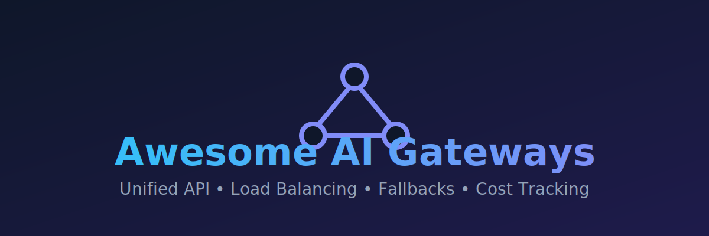

<div align="center">
  

  <h1>🚀 Awesome AI Gateways</h1>

  <p><strong>A curated list of the best AI Gateways, LLM Routers, and Proxies to unify OpenAI, Anthropic, Gemini, and more.</strong></p>

  <p>
    <a href="https://github.com/ishandutta2007/Awesome-Awesome-Awesome"></a><a href="https://discord.gg/jc4xtF58Ve"></a>
    
    
    
    
    
	<a href="https://github.com/ishandutta2007"></a>
  </p>

  <h4>Unified API • Load Balancing • Fallbacks • Cost Tracking • Observability</h4>
</div>

---

## 🌟 Introduction

This repository is an SEO-optimized, curated ecosystem of **SaaS platforms** and **Open-Source projects** for building **AI Gateways**. These intelligent proxies act as a unified bridge to multiple LLM providers, ensuring high availability, performance, and significant cost savings.

### 🔄 How it Works
<div align="center">
  
</div>

---
## 🧭 Which Gateway Should I Use?

Not sure where to start? Use this quick guide:

| Your situation | Recommended option |
|---|---|
| Student or beginner experimenting with LLMs | OpenRouter (1M free req/mo) or LangChain |
| Building a production app and need observability | Portkey or Helicone |
| Want everything self-hosted and private | LiteLLM open-source |
| Need edge performance and global scale | Cloudflare AI Gateway |
| Building AI agents with complex routing logic | LangChain / LangGraph |
| Running local models on your own machine | Ollama + Open WebUI |
| Enterprise with budget management and SSO | LiteLLM Cloud |

---

## 📑 Table of Contents
- [🌐 SaaS Products](#-saas-products)
- [🏗️ Open-Source GitHub Projects](#-open-source-github-projects)
- [🤝 How to Contribute](#-how-to-contribute)
- [⚖️ Disclaimer](#-disclaimer)

---

## 🌐 SaaS Products

### 📊 Core AI Gateway Comparison

| SaaS Product | Company Size (Valuation/Revenue) | Pricing Model | Free Tier Limit | Key Features |
| :--- | :--- | :--- | :--- | :--- |
| **[Cloudflare AI Gateway](https://developers.cloudflare.com/ai-gateway/)** | ~$76B Valuation | Usage-based | 100,000 logs/month | Edge-native; unlimited requests; caching & rate limiting. |
| **[OpenRouter](https://openrouter.ai/)** | ~$1.3B Valuation | 5.5% Platform Fee | 1M req/mo (BYOK) | Aggregates 100+ LLMs; smart routing & fallback. |
| **[Portkey](https://portkey.ai/)** | ~$130M (Acquired) | $49/mo+ | 10,000 logs/month | Observability, caching, guardrails, and multi-provider routing. |
| **[Helicone](https://helicone.ai/)** | Acquired by Mintlify | $79/mo+ | 10,000 requests/month | LLM observability, custom properties, and cost tracking. |
| **[PromptLayer](https://promptlayer.com/)** | ~$4.8M Valuation | $49/mo+ | 2,500 requests/month | Prompt management, versioning, and evaluation middleware. |
| **[LiteLLM Cloud](https://litellm.ai/)** | ~$2.1M Raised | $250/mo+ | 7-30 day trial | Managed proxy with RBAC, budget management, and SSO. |
| **[Glama](https://glama.ai/)** | Bootstrapped | $9/mo+ | Free MCP hosting | Performance-focused gateway and MCP server hosting. |
| **[Prism API](https://github.com/go165/prism-api-promo)** | Independent gateway | Usage-based | Google signup trial balance | OpenAI-compatible access to GPT-5.5 and other model families with crypto-friendly recharge and vouchers. |

### 🛠️ Platform Details

- **[Cloudflare AI Gateway](https://developers.cloudflare.com/ai-gateway/)** ☁️  
  Edge-native gateway with powerful caching, rate limiting, and global performance benefits.
- **[OpenRouter](https://openrouter.ai/)** 🚀  
  Leading intelligent router that aggregates dozens of LLMs with smart model routing, fallback, and competitive pricing.
- **[Portkey](https://portkey.ai/)** 🔑  
  Full-featured AI gateway with observability, caching, guardrails, and multi-provider routing.
- **[Helicone](https://helicone.ai/)** 🔦  
  Popular observability platform for LLMs with easy integration via proxy or SDK.
- **[PromptLayer](https://promptlayer.com/)** 📑  
  Specialized platform for prompt engineering, management, and tracking production LLM usage.
- **[LiteLLM](https://litellm.ai/)** 🛡️  
  Popular proxy layer with unified API and advanced routing, logging, and cost management features.
- **[Glama](https://glama.ai/)** 💎  
  Modern AI gateway focused on performance, reliability, and developer-friendly features.
- **[Prism API](https://github.com/go165/prism-api-promo)**  
  Independent OpenAI-compatible gateway for overseas developers, with low-cost GPT-5.5 access, quota controls, and crypto-friendly recharge/voucher options.

---

## 🏗️ Open-Source GitHub Projects

### 🛠️ Dedicated AI Gateway & Proxy Solutions

- **[Open WebUI](https://github.com/open-webui/open-webui)** [](https://github.com/open-webui/open-webui/stargazers) 🐳  
  Complete local LLM platform with robust API gateway and multi-model routing capabilities.

- **[vLLM](https://github.com/vllm-project/vllm)** [](https://github.com/vllm-project/vllm/stargazers) ⚡  
  High-performance inference server with custom gateway layers for production LLM routing.

- **[LiteLLM](https://github.com/BerriAI/litellm)** [](https://github.com/BerriAI/litellm/stargazers) ⭐  
  The most popular open-source LLM proxy and gateway. Supports 100+ models with unified OpenAI-compatible API, load balancing, fallback, caching, logging, and cost tracking.

- **[FastChat](https://github.com/lm-sys/FastChat)** [](https://github.com/lm-sys/FastChat/stargazers) 💬  
  Open platform for training, serving, and evaluating chatbots with multi-model gateway support.

- **[LocalAI](https://github.com/mudler/LocalAI)** [](https://github.com/mudler/LocalAI/stargazers) 🤖  
  Self-hosted drop-in replacement for OpenAI with support for many backends and gateway features.

- **[Portkey Gateway](https://github.com/Portkey-AI/gateway)** [](https://github.com/Portkey-AI/gateway/stargazers) 🧩  
  Open-source core of Portkey with powerful routing, observability, and guardrails capabilities.

- **[OpenRouter Self-Hosted](https://github.com/search?q=openrouter+self+hosted)** 🏠  
  Community self-hosted routers inspired by OpenRouter with multi-provider support.

### 📦 Additional Strong Open-Source Options

- **[Dify](https://github.com/langgenius/dify)** [](https://github.com/langgenius/dify/stargazers) — AI app platform with built-in model routing and gateway.
- **[LangChain](https://github.com/langchain-ai/langchain)** [](https://github.com/langchain-ai/langchain/stargazers) is an open-source framework for building LLM-powered applications with built-in support for routing between multiple providers including OpenAI, Anthropic, Google Gemini, and more.
- **[LangGraph](https://github.com/langchain-ai/langgraph)** [](https://github.com/langchain-ai/langgraph/stargazers) extends this with stateful, multi-agent orchestration and conditional routing logic.
- **[Semantic Kernel](https://github.com/microsoft/semantic-kernel)** [](https://github.com/microsoft/semantic-kernel/stargazers) — Microsoft’s AI orchestration with gateway-like features.

**Best for:** Developers building AI agents, RAG pipelines, and multi-step reasoning applications that need flexible, code-driven model routing.

**Key features:**
- Unified interface across 50+ LLM providers
- Built-in memory, tool calling, and agent frameworks
- LangGraph enables complex conditional routing between models
- Active community and extensive documentation

**Quick start:**
```python
from langchain_anthropic import ChatAnthropic
from langchain_openai import ChatOpenAI

# Switch providers with one line — same interface
model = ChatAnthropic(model="claude-sonnet-4-20250514")
model = ChatOpenAI(model="gpt-4o")
```

---

## 🤝 How to Contribute

1. Fork the repo.
2. Add/edit entries in `README.md` (follow existing format).
3. Include: name, link, 1–2 sentence description, and whether it's SaaS or open-source.
4. Submit PR with a short explanation.


<a href="https://github.com/ishandutta2007"></a>


---

## ⚖️ Disclaimer

- This is a **community-curated** list — not exhaustive and not an endorsement.
- Self-hosted open-source gateways require proper security, monitoring, and rate limiting configuration.

---

## 📈 Star History

<div align="center">
	<a href="https://www.star-history.com/?repos=ishandutta2007%2FAwesome-AI-Gateways&type=date&legend=bottom-right">
	 <picture>
	   <source media="(prefers-color-scheme: dark)" srcset="https://api.star-history.com/chart?repos=ishandutta2007/Awesome-AI-Gateways&type=date&theme=dark&legend=bottom-right" />
	   <source media="(prefers-color-scheme: light)" srcset="https://api.star-history.com/chart?repos=ishandutta2007/Awesome-AI-Gateways&type=date&legend=bottom-right" />
	   
	 </picture>
	</a>
</div>

---

**Made for AI engineers, developers, and teams building scalable LLM applications.**  
Let's make LLM access more reliable, private, and cost-effective.
